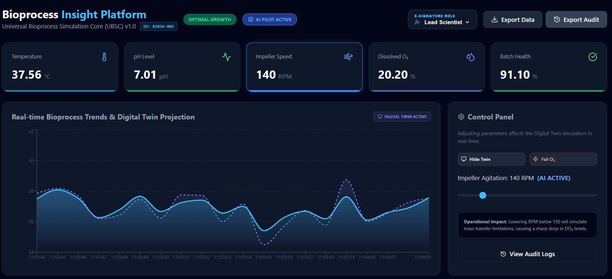

# Bioprocess Insight Platform (BIP) 🧬

**A Real-time Bioreactor Monitoring Dashboard for Industrial Fermentation**

## 🧪 Project Overview
This platform simulates a live connection to a **Sartorius Biostat®** controller, providing real-time data visualization and automated anomaly detection for critical process parameters (CPPs). It utilizes a **Triad Microservice Architecture** to bridge the gap between historical data, AI-driven automation, and live operational compliance.

---
## 📈 Business & Operational Impact

The implementation of the Bioprocess Insight Platform (BIP) directly addresses the high-risk nature of pharmaceutical manufacturing by replacing reactive monitoring with **proactive intelligence**.

### 1. Risk Mitigation & Yield Protection
By utilizing the **AI Pilot** and **Digital Twin projections**, the system can anticipate a thermal or oxygen-related deviation up to 60 seconds before it occurs. In a production environment, this translates to saving batches worth hundreds of thousands of dollars that would otherwise be lost to process excursions.

### 2. Regulatory Readiness (GxP)
The platform is engineered with a "Compliance-First" mindset. By automating the **Audit Trail** via a dedicated .NET microservice, the system ensures that every operator interaction is recorded in a 21 CFR Part 11 compliant format, significantly reducing the time required for QA review and regulatory filing.

### 3. Operational Efficiency
The **Industrial HMI** simplifies multivariate data. By translating complex sensor telemetry into a single **Batch Health Score**, operators can manage multiple bioreactors simultaneously with high-fidelity "At-a-Glance" observability, reducing the cognitive load and potential for human error.

### 4. Technical Scalability
The **Triad Microservice Architecture** ensures that the system is not a monolith. The Data Engine, Compliance Service, and HMI can be scaled independently, allowing the platform to grow from a single R&D lab to an enterprise-wide manufacturing execution system (MES).

---

## 📸 Dashboard Preview


## 📸 Dashboard Preview (AI ACTIVE)


---

## 🌍 Live Deployment
The platform is fully orchestrated across a distributed cloud architecture:

- **Frontend/Live HMI Dashboard:** [https://bioprocess-insights-platform.vercel.app/] (Hosted on Vercel)
- **Backend API:** [https://bioprocess-insights-platform.onrender.com/api/v1/process-data] (Hosted on Render)
- **Audit Service:**[https://bioprocess-audit-service.onrender.com/api/audit]


---
## 🏗️ System Architecture

This system utilizes a **Decoupled Triad Architecture**:

1. **HMI Layer (React/TS):** A high-fidelity dashboard (Node 22) featuring **E-Signature Roles**, real-time charting and GxP-compliant pulsing alarms. The "Human-Machine Interface"—orchestrates data from both backends into a unified real-time view.

2. **Digital Twin Engine (Python/FastAPI):** Handles high-frequency mathematical projections, **AI Pilot** automated correction logic, and physics-based simulations (Oxygen Transfer Rate). The "SCADA" layer—handles high-frequency mathematical projections and Digital Twin logic.

3. **Compliance Service (.NET 10/C#):** An independent audit microservice that records **immutable** logs of all operator interactions (21 CFR Part 11). The "Compliance" layer—ensures all interactions are logged for regulatory review.


### Project Architecture Diagram


---

### 🏗️ Cloud Architecture
- **CI/CD:** Automatic deployments triggered via GitHub Actions.

- **Environment Management:** Utilizes `VITE_API_URL` environment variables to dynamically switch between local development and production API endpoints.

- **Cross-Origin Resource Sharing (CORS):** Backend configured to securely communicate with the Vercel-hosted frontend.

- **Containerization:** The .NET Compliance Service is fully containerized using Docker (Multi-stage builds) to ensure environment parity between development and the Render production environment.


---

## 🚀 Key Features

### 🤖 Intelligent Automation & Batch Logic
* **AI Pilot (Closed-Loop Control):** A newly integrated AI layer that monitors batch health. If Dissolved Oxygen ($DO_2$) drops below critical thresholds, the AI Pilot takes control of the Impeller RPM to restore optimal growth
  * **Real-time Data Engine:** Built with **FastAPI** to stream multivariate sensor telemetry (Temperature, pH, Dissolved Oxygen) at a high-frequency 1000ms interval.
  * **Dynamic Physics Simulation:** Features a real-time mathematical correlation between **Impeller RPM** and **Oxygen Mass Transfer**, allowing the simulation to react physically to operator input.
  * **Batch Health Scoring:** An algorithmic viability index that calculates real-time "Golden Batch" deviations based on thermal and chemical setpoint variances.
  * **Automated Anomaly Detection:** Intelligent flagging system for out-of-spec events, such as thermal spikes or mechanical agitation failure.
* **Batch ID Tracking:** Implemented a unique batch numbering system ``(e.g., B2026-001)`` that persists across the API and HMI, ensuring every production run is isolated and identifiable.
* **Predictive Digital Twin Visualisation:** Utilizes a moving-window linear regression algorithm to project temperature trends 60 seconds into the future, anticipating shifts before they occur. _A predictive area chart overlay that projects future temperature trends using linear regression over a sliding window._

### 🛡️ Compliance, Data Integrity & Digital Signature
* **Role-Based E-Signatures:** Operators can switch between roles (Lead Scientist, Lab Tech, QA Auditor). Every action is digitally signed and attributed to the active role in the Audit Trail.
* **Immutable GxP Audit Trail:** Integrated **.NET 10 microservice** (Powered by .NET 10) that records immutable logs capturing Setpoint changes, Anomaly injections, and Data exports with millisecond-precision timestamps ensuring 21 CFR Part 11 compliance.
* **Data Portability:** Secure one-click CSV export engine for generating full batch historical reports for offline analysis.
* **21 CFR Part 11 Exports:** Features a dedicated Audit Export engine that generates CSV "receipts" of all verified interactions.

### 🧪 Process Physics & Chaos Engineering
* **Oxygen Mass Transfer Simulation:** Real-time mathematical correlation between Impeller RPM and Oxygen Mass Transfer ($k_La$).
* **Anomaly Injection:** A "Chaos" feature allowing operators to manually trigger process failures (O2 deviation) to test system resilience and GxP alarm response.

### 🚨 Industrial UI/UX
* **Interactive HMI:** Dynamic dashboard featuring live-synced area charts and KPI cards built with **React** and **Recharts**.
* **Deterministic Alarms:** High-contrast pulsing animations for "Critical" states, engineered to reduce operator reaction time during process excursions.
* **Dynamic Status Badging:** At-a-glance operational indicators (**OPTIMAL**, **SUB-OPTIMAL**, **CRITICAL**) driven by real-time health score logic.
* **AI Active:** Showing when the AI takes over the system to restore balance.

---

## 🛡️ GxP Compliance & Audit Trail
In biopharmaceutical manufacturing, **Data Integrity** is non-negotiable (21 CFR Part 11). This platform includes a dedicated **.NET Audit Microservice** that:
- **Immutable Logging:** Records every operator action (Setpoint changes, Data exports) in a secure audit trail.
- **Microservice Coordination:** Demonstrates a polyglot architecture where the React HMI communicates with both the Python Engine and the .NET Compliance Service simultaneously.
- **Lead Scientist Authorization:** Simulates a permission-based logging system where actions are tied to specific user roles.

---

## 🛠️ The Stack (Full-Stack Triad Architecture)
* **Backends (Polyglot Layer):**
    * **Data Engine:** Python 3.12, **FastAPI**, Pandas (High-frequency telemetry & AI Pilot logic)
    * **Compliance/Audit:** **.NET 10**, C#, ASP.NET Core (Immutable GxP logging)
* **Frontend (Industrial HMI):**
    * **React 18** (TypeScript), **Node 22**, **Recharts** (Real-time data visualization), **Lucide-React** (Iconography)
* **Data & Persistence:**
    * **SQLite** (Local edge storage for audit trails), **Entity Framework Core** (ORM for strict data integrity)
* **Styling & UX:**
    * **CSS-in-JS**, **Custom CSS Keyframes** (Deterministic GxP pulsing alarm animations)
* **Infrastructure & DevOps:**
    * **Docker & Docker Compose** (Multi-container orchestration for environment parity)
    * **GitHub Actions** (CI/CD Pipeline)
* **Cloud Hosting:**
    * **Vercel** (Frontend), **Render** (Distributed Backends)

---

## 🚦 Getting Started (Docker Dev Mode)
The entire triad is containerized for environment parity. To launch the full platform including the Python API, .NET Service, and React HMI:

```bash
# 1. Clone the repository
git clone https://github.com/your-repo/bip-platform.git

# 2. Launch with Docker Compose
docker-compose up --build
```

---

## 🚦 Getting Started (Local Development)

To run the full suite locally, you must have **Python 3.10+**, **Node 22**, and the **.NET 8/10 SDK** installed.

### 1. Environment Configuration
Create a file named ``.env.local`` in the ``/frontend`` directory:

```Code snippet
VITE_API_URL=http://localhost:8000
VITE_AUDIT_SERVICE_URL=http://localhost:5197
```

### 2. Launch Services (Open 3 Terminals)
- **Terminal 1: Python Engine**

```bash
cd backend && python -m venv venv && source venv/bin/activate
pip install -r requirements.txt
python main.py

```

- **Terminal 2: .NET Audit Service**

```bash
cd AuditService
dotnet run --urls=http://localhost:5197
```
- **Terminal 3: React HMI**

```bash
cd frontend
npm install
npm run dev
```

---

### 3. Code Standards & Quality
- **Type Safety:** Utilizes strict TypeScript interfaces for multivariate sensor data.
- **Environment Awareness:** Implemented dynamic API routing to switch between `localhost` and `production` cloud endpoints automatically.


### 4. 🌐 Local Access
Once both services are started, the platform is available at:

| Component | URL | Port |
| :--- | :--- | :--- |
| **BIP Dashboard (Frontend)** | `http://localhost:5173` | 5173 |
| **Data Stream (API)** | `http://127.0.0.1:8000/api/v1/process-data` | 8000 |
| **Interactive API Docs** | `http://127.0.0.1:8000/docs` |
| **Audit Service** | `http://localhost:5197/api/audit` | 5197 |

---

## 📡 API Documentation

This platform utilizes a multi-service API architecture to separate real-time process simulation from regulatory compliance logging.

- **API Documentation (Swagger):** [https://bioprocess-insights-platform.onrender.com/docs]

### 🐍 Python Data Engine (SCADA & Digital Twin)
The core engine managing real-time process logic, AI-driven projections, and simulation states.

| Endpoint | Method | Key Feature | Description |
| :--- | :--- | :--- | :--- |
| `/api/v1/process-data` | `GET` | **Real-time Telemetry** (_Primary Data Stream_) | Returns real-time telemetry, health scores, and Digital twin projections. |
| `/api/v1/control` | `POST` | **AI Pilot & HMI** | Receives setpoint changes (e.g., RPM) to update the Digital Twin simulation state. |
| `/api/v1/trigger-anomaly` |	`POST` |	**Chaos Engineering** |Injects simulated process failures to test system resilience.|
| `/api/v1/download-report` | `GET` | **Export Engine** |Streams the full `bioreactor-yields.csv` file for offline analysis. |

### 🛡️ .NET Compliance Service (GxP Audit)
| Endpoint | Method | Key Feature | Description |
| :--- | :--- | :--- | :--- |
| `/api/audit` | `POST` | **Immutable GxP Logs** | Records operator actions, Role-Based E-Signatures, and timestamps for 21 CFR Part 11. |

---

### 🛠️ Sample Payloads

#### 1. Control Signal (POST to Python)
Sent when the operator adjusts the Impeller Agitation slider.
```json
{
  "rpm": 450
}
```

#### 2. Audit Log (POST to .NET)
Sent simultaneously with control signals to ensure data integrity.
```json
{
  "action": "Setpoint Change",
  "user": "Lead Scientist",
  "details": "Operator adjusted Impeller Speed to 450 RPM"
}
``` 
---

## 🛠️ Implementation Highlights & Challenges

### 1. Full-Stack Monorepo Architecture
One of the primary challenges was managing two distinct environments (Python/FastAPI and Node/Vite) within a single repository. 
- **Solution:** Implemented a structured directory approach, isolating the `venv` within the `/backend` and `node_modules` within the `/frontend`. This ensures that dependency conflicts are non-existent and the root directory remains clean.

### 2. Relative Path Resolution
Since the backend service runs from within the `/backend` folder but needs to access data in the root-level `/data` folder, standard file paths would often break.
- **Solution:** Used Python's `os.path.abspath(__file__)` to create a dynamic `BASE_DIR`. This allows the application to resolve the CSV path correctly regardless of whether the script is launched from the root or the subfolder / (regardless of the environment).

### 3. Real-Time Data Simulation
To mimic a live Biostat® controller without having a physical bioreactor connected, I implemented a global index tracker in FastAPI.
- **Logic:** The API iterates through historical CSV rows on every request, calculates "derived metrics" (Health Score) on the fly, and loops back to the start, providing a continuous "live" data stream for the frontend to consume.

### 4. Cross-Origin Resource Sharing (CORS) in a Triad Architecture
Managing three independent services (React on `:5173`, FastAPI on `:8000`, and .NET on `:5197`) presented a significant CORS challenge. 
- **Solution:** Configured the FastAPI `CORSMiddleware` and the .NET `UseCors` policy to specifically whitelist the frontend origin. This ensures secure, authenticated communication across the different ports of the "Triad."

### 5. Distributed Transaction Simulation for GxP: > 
Implemented a **Synchronous Hook** pattern in the React HMI. To ensure 21 CFR Part 11 integrity, every POST request to the Python Control Engine is paired with a concurrent POST to the .NET Audit Service. This ensures that a setpoint change never occurs without a corresponding immutable log entry.

### 6. Real-Time Data Synchronization & Physics Simulation
To move beyond static playback, I needed the HMI to reflect real-world physics (Oxygen transfer) based on manual operator input.
- **Solution:** Integrated a global state in the FastAPI backend that intercepts historical CSV data and modifies the Dissolved Oxygen ($DO_2$) values on-the-fly using the formula: $DO_2 \approx (RPM_{user} / 300) \times DO_{2,historical}$.

### 7. Dynamic Visual Feedback for Operator Safety
Implementing "At-a-glance" observability required the HMI to translate complex health scores into immediate visual cues.
- **Solution:** Developed a conditional CSS engine that monitors the `health_score`. When the score drops below 70%, it dynamically applies a `critical-pulse` keyframe animation to the status badge, mimicking the physical LED alarm towers found on industrial Biostat® controllers.

---

## 🧠 Business Logic & Calculations

### 1. Batch Health Score
The health score is a simulated Quality Index ($Q$) calculated based on the deviation from the ideal setpoints ($T_{set} = 37°C$, $pH_{set} = 7.0$):

$$Health = 100 - (|T_{actual} - 37| \times 15) - (|pH_{actual} - 7| \times 40)$$


### 2. AI Pilot Correction Logic
When $DO_2 < 20\%$, the AI Pilot activates and calculates the necessary RPM boost:$$RPM_{new} = \min(600, RPM_{current} + \Delta Correction)$$

### 3. Anomaly Triggers
A batch is flagged as an Anomaly if:
- Temperature > $40.0°C$
- Impeller Speed < $100.0\ RPM$

### 4. Digital Twin & Predictive Analytics
The platform features a **Digital Twin** layer that uses a moving-window linear regression to predict process trends:
- **Calibration Phase:** Upon startup, the system enters a 5-second "Warm-up" to populate the sliding buffer required for accurate slope calculation.
- **Trend Analysis:** Predicts Temperature 60 seconds into the future based on the current $\Delta T / \Delta t$.
- **Predictive Alarms:** Early warning system that triggers if the Digital Twin deviates from the safety setpoints before the physical sensors do /reach the threshold.

$$T_{pred} = T_{curr} + \left(\frac{T_{curr} - T_{prev}}{\Delta t}\right) \times 60$$


### 4. Closed-Loop Simulation (Oxygen Transfer)
To simulate real-world physics, the platform links Impeller Agitation ($RPM$) to Dissolved Oxygen ($DO_2$):
$$DO_2 \approx \left(\frac{RPM_{manual}}{300}\right) \times DO_{2,historical}$$
This allows the Digital Twin to react dynamically when an operator adjusts the slider in the Control Panel.


---

## 📂 Repository Structure

```Plaintext
├── backend/               # FastAPI Server, AI Pilot & Digital Twin Logic
├── AuditService/          # .NET 10 Compliance & Audit Microservice
├── frontend/              # React/TypeScript HMI & Dashboard
├── data/                  # Source CSV files (bioreactor-yields.csv)
├── docker-compose.yml     # Multi-service orchestrator
├── .gitignore             # Git exclusion rules
└── README.md              # Project Documentation
```
---

## 📜 License
This project is licensed under the MIT License - see the LICENSE file for details.
