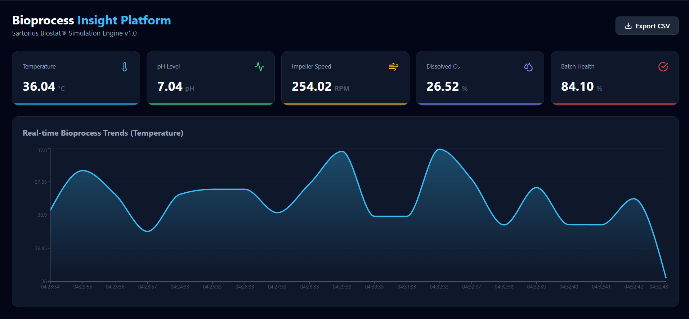

# Bioprocess Insight Platform (BIP) 🧬

**A Real-time Bioreactor Monitoring Dashboard for Industrial Fermentation**

## 🧪 Project Overview
This platform simulates a live connection to a **Sartorius Biostat®** controller, providing real-time data visualization and automated anomaly detection for critical process parameters (CPPs). It bridges the gap between raw CSV historical data and live operational visibility.


## 📸 Dashboard Preview



### 🚀 Key Features
- **Real-time API:** Built with FastAPI to stream multivariate sensor data every 1000ms.
- **Interactive Dashboard:** Live charting of Temperature, pH, and DO2 using React & Recharts.
- **Batch Health Scoring:** Algorithmic calculation of batch viability based on setpoint deviations.
- **Anomaly Detection:** Automated flagging of out-of-spec batches (e.g., thermal spikes or agitation failure).
- **Data Portability:** One-click CSV export of the bioreactor yield reports.

## 🛠️ Tech Stack
- **Backend:** Python 3.12, FastAPI, Pandas
- **Frontend:** React (TypeScript), Recharts, Lucide-React
- **Styling:** CSS-in-JS (Modern Dark-Mode UI)

---

## 🚦 Getting Started

### 1. Prerequisites
- Python 3.10+ 
- Node.js (v18+)
- npm or yarn

---

### 2. Backend Setup
Navigate to the `backend` directory, create a virtual environment, and install dependencies:

```bash
cd backend
python -m venv venv
# Windows:
.\venv\Scripts\activate 
# Mac/Linux:
source venv/bin/activate

pip install -r requirements.txt
python main.py

```
--- 

### 3. Frontend Setup
In a new terminal, navigate to the frontend directory:

```bash
cd frontend
npm install
npm run dev
```

---

## 🌐 Local Access
Once both services are started, the platform is available at:

| Component | URL |
| :--- | :--- |
| **BIP Dashboard (Frontend)** | `http://localhost:5173` |
| **Data Stream (API)** | `http://127.0.0.1:8000/api/v1/process-data` |
| **Interactive API Docs** | `http://127.0.0.1:8000/docs` |

---

## 📡 API Documentation

| Endpoint | Method | Description |
| :--- | :--- | :--- |
| `/api/v1/process-data` | `GET` | **Primary Data Stream:** Returns real-time telemetry, health scores, and anomaly flags. |
| `/api/v1/download-report` | `GET` | **Export Engine:** Streams the full `bioreactor-yields.csv` file for offline analysis. |

---

## 🛠️ Implementation Highlights & Challenges

### 1. Full-Stack Monorepo Architecture
One of the primary challenges was managing two distinct environments (Python/FastAPI and Node/Vite) within a single repository. 
- **Solution:** Implemented a structured directory approach, isolating the `venv` within the `/backend` and `node_modules` within the `/frontend`. This ensures that dependency conflicts are non-existent and the root directory remains clean.

### 2. Relative Path Resolution
Since the backend service runs from within the `/backend` folder but needs to access data in the root-level `/data` folder, standard file paths would often break.
- **Solution:** Used Python's `os.path.abspath(__file__)` to create a dynamic `BASE_DIR`. This allows the application to resolve the CSV path correctly regardless of whether the script is launched from the root or the subfolder.

### 3. Real-Time Data Simulation
To mimic a live Biostat® controller without having a physical bioreactor connected, I implemented a global index tracker in FastAPI.
- **Logic:** The API iterates through historical CSV rows on every request, calculates "derived metrics" (Health Score) on the fly, and loops back to the start, providing a continuous "live" data stream for the frontend to consume.

---

## 🧠 Business Logic & Calculations

### Batch Health Score
The health score is a simulated Quality Index ($Q$) calculated based on the deviation from the ideal setpoints ($T_{set} = 37°C$, $pH_{set} = 7.0$):

$$Health = 100 - (|T_{actual} - 37| \times 15) - (|pH_{actual} - 7| \times 40)$$

### Anomaly Triggers
A batch is flagged as an Anomaly if:
- Temperature > $40.0°C$
- Impeller Speed < $100.0\ RPM$

---

## 📂 Repository Structure

```Plaintext
├── backend/               # FastAPI Server & Business Logic
├── frontend/              # React/TypeScript Dashboard
├── data/                  # Source CSV files (bioreactor-yields.csv)
├── .gitignore             # Git exclusion rules
└── README.md              # Project Documentation
```
---

## 📜 License
This project is licensed under the MIT License - see the LICENSE file for details.
