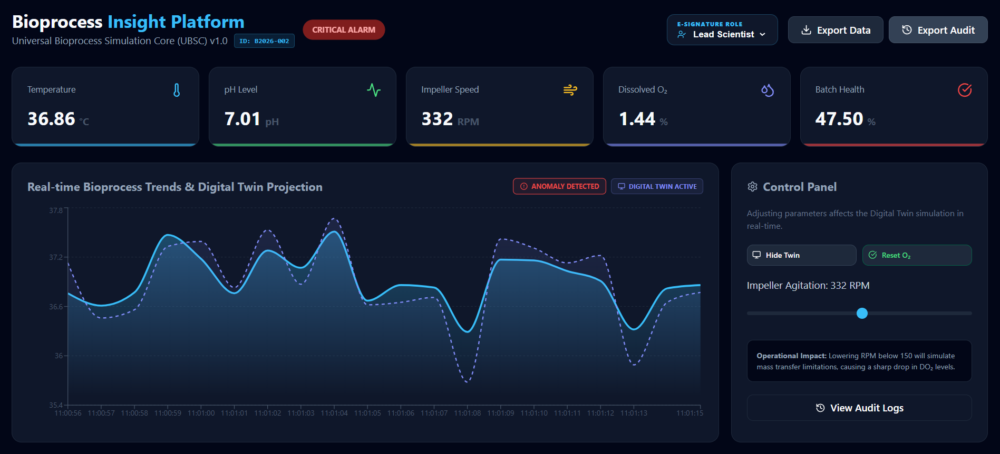
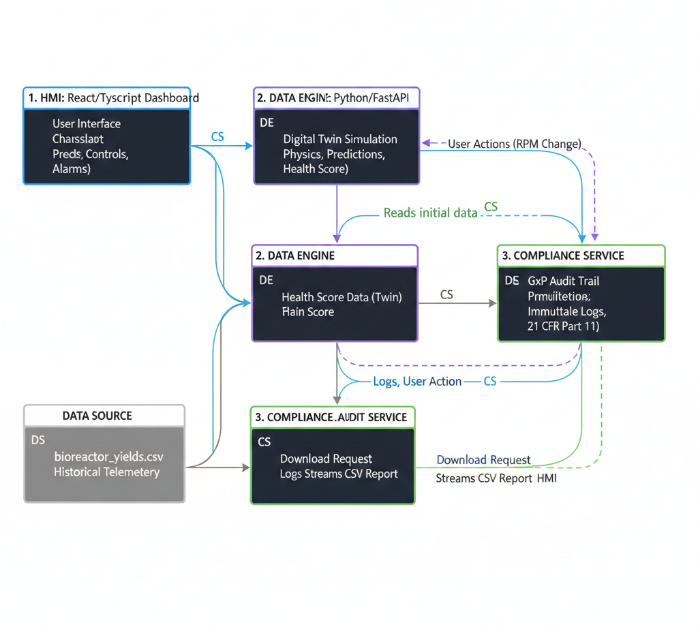
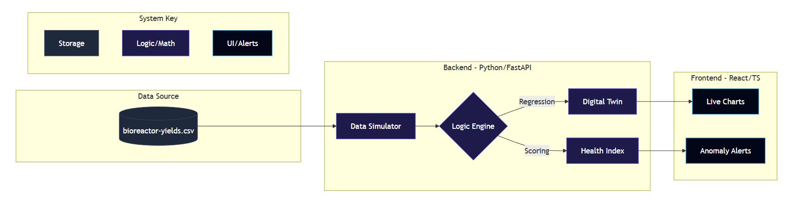
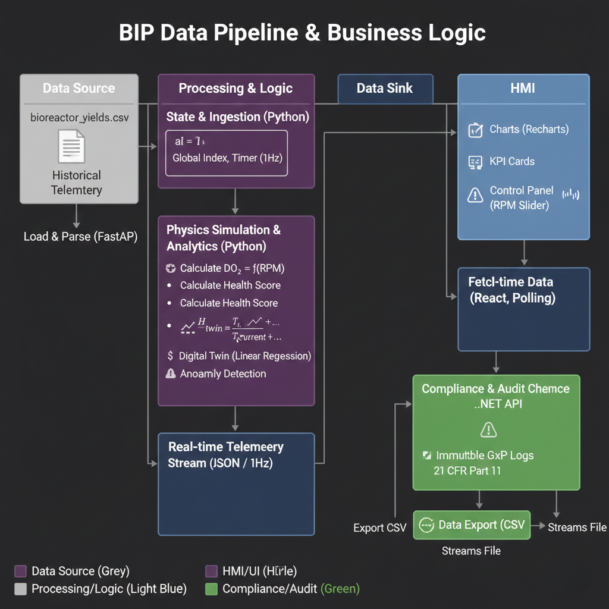

# Bioprocess Insight Platform (BIP) 🧬

**A Real-time Bioreactor Monitoring Dashboard for Industrial Fermentation**

## 🧪 Project Overview
This platform simulates a live connection to a **Sartorius Biostat®** controller, providing real-time data visualization and automated anomaly detection for critical process parameters (CPPs). It utilizes a **Triad Microservice Architecture** to bridge the gap between historical data and live operational compliance.

---

## 📸 Dashboard Preview


---

## 🌍 Live Deployment
The platform is fully orchestrated across a distributed cloud architecture:

- **Frontend/Live HMI Dashboard:** [https://bioprocess-insights-platform.vercel.app/] (Hosted on Vercel)
- **Backend API:** [https://bioprocess-insights-platform.onrender.com/api/v1/process-data] (Hosted on Render)


---
## 🏗️ System Architecture

This system utilizes a **Decoupled Triad Architecture**:

1. **HMI Layer (React/TS):** A high-fidelity dashboard with real-time charting and GxP-compliant pulsing alarms. The "Human-Machine Interface"—orchestrates data from both backends into a unified real-time view.

2. **Digital Twin Engine (Python/FastAPI):** Handles high-frequency mathematical projections and physics-based simulations (Oxygen Transfer Rate). The "SCADA" layer—handles high-frequency mathematical projections and Digital Twin logic.

3. **Compliance Service (.NET 10/C#):** An independent audit microservice that records immutable logs of all operator interactions (21 CFR Part 11). The "Compliance" layer—ensures all interactions are logged for regulatory review.




### Project Architecture Diagram



---

### 🏗️ Cloud Architecture
- **CI/CD:** Automatic deployments triggered via GitHub Actions.

- **Environment Management:** Utilizes `VITE_API_URL` environment variables to dynamically switch between local development and production API endpoints.

- **Cross-Origin Resource Sharing (CORS):** Backend configured to securely communicate with the Vercel-hosted frontend.

- **Containerization:** The .NET Compliance Service is fully containerized using Docker (Multi-stage builds) to ensure environment parity between development and the Render production environment.


---

## 🚀 Key Features

### 🧪 Core Process Logic
* **Real-time Data Engine:** Built with **FastAPI** to stream multivariate sensor telemetry (Temperature, pH, Dissolved Oxygen) at a high-frequency 1000ms interval.
* **Predictive Digital Twin:** Utilizes a moving-window linear regression algorithm to project temperature trends 60 seconds into the future, anticipating shifts before they occur.
* **Dynamic Physics Simulation:** Features a real-time mathematical correlation between **Impeller RPM** and **Oxygen Mass Transfer**, allowing the simulation to react physically to operator input.
* **Batch Health Scoring:** An algorithmic viability index that calculates real-time "Golden Batch" deviations based on thermal and chemical setpoint variances.
* **Automated Anomaly Detection:** Intelligent flagging system for out-of-spec events, such as thermal spikes or mechanical agitation failure.

### 🛡️ Compliance & Data Integrity
* **GxP Audit Trail:** Integrated **.NET 10 microservice** that records immutable logs of every setpoint change and data export, ensuring 21 CFR Part 11 compliance.
* **Data Portability:** Secure one-click CSV export engine for generating full batch historical reports for offline analysis.

### 🚨 Industrial UI/UX
* **Interactive HMI:** Dynamic dashboard featuring live-synced area charts and KPI cards built with **React** and **Recharts**.
* **Deterministic Alarms:** High-contrast pulsing animations for "Critical" states, engineered to reduce operator reaction time during process excursions.
* **Dynamic Status Badging:** At-a-glance operational indicators (**OPTIMAL**, **SUB-OPTIMAL**, **CRITICAL**) driven by real-time health score logic.

---

## 🛡️ GxP Compliance & Audit Trail
In biopharmaceutical manufacturing, **Data Integrity** is non-negotiable (21 CFR Part 11). This platform includes a dedicated **.NET Audit Microservice** that:
- **Immutable Logging:** Records every operator action (Setpoint changes, Data exports) in a secure audit trail.
- **Microservice Coordination:** Demonstrates a polyglot architecture where the React HMI communicates with both the Python Engine and the .NET Compliance Service simultaneously.
- **Lead Scientist Authorization:** Simulates a permission-based logging system where actions are tied to specific user roles.

---

## 🛠️ Tech Stack
- **Backend (Data Engine):** Python 3.12, FastAPI, Pandas
- **Backend (Compliance/Audit):** .NET 10, C#, ASP.NET Core
- **Frontend (HMI):** React (TypeScript), Recharts, Lucide-React
- **Styling:** CSS-in-JS & GxP Alarm Animations (Custom CSS Keyframes)


---

## 🚦 Getting Started

### 1. Prerequisites
- Python 3.10+ 
- Node.js (v18+)
- npm or yarn


### 2. Backend Setup
Navigate to the `backend` directory, create a virtual environment, and install dependencies:

```bash
cd backend
python -m venv venv
# Windows:
.\venv\Scripts\activate 
# Mac/Linux:
source venv/bin/activate

pip install -r requirements.txt
python main.py

```

### 3. Frontend Setup
In a new terminal, navigate to the frontend directory:

```bash
cd frontend
npm install
npm run dev
```

### 4. Compliance Service Setup (.NET)
In a new terminal, navigate to the audit service directory:
```bash
cd AuditService
dotnet run
```

### 4. Code Standards & Quality
- **Type Safety:** Utilizes strict TypeScript interfaces for multivariate sensor data.
- **Environment Awareness:** Implemented dynamic API routing to switch between `localhost` and `production` cloud endpoints automatically.


###  5. 🌐 Local Access
Once both services are started, the platform is available at:

| Component | URL |
| :--- | :--- |
| **BIP Dashboard (Frontend)** | `http://localhost:5173` |
| **Data Stream (API)** | `http://127.0.0.1:8000/api/v1/process-data` |
| **Interactive API Docs** | `http://127.0.0.1:8000/docs` |

---

## 📡 API Documentation

This platform utilizes a multi-service API architecture to separate real-time process simulation from regulatory compliance logging.

- **API Documentation (Swagger):** [https://bioprocess-insights-platform.onrender.com/docs]

### 🐍 Python Data Engine (SCADA & Digital Twin)
| Endpoint | Method | Description |
| :--- | :--- | :--- |
| `/api/v1/process-data` | `GET` | **Primary Data Stream:** Returns real-time telemetry, health scores, and twin projections. |
| `/api/v1/control` | `POST` | **HMI Control:** Receives setpoint changes (e.g., RPM) to update the Digital Twin simulation state. |
| `/api/v1/download-report` | `GET` | **Export Engine:** Streams the full `bioreactor-yields.csv` file for offline analysis. |

### 🛡️ .NET Compliance Service (GxP Audit)
| Endpoint | Method | Description |
| :--- | :--- | :--- |
| `/api/audit` | `POST` | **Compliance Logging:** Records immutable logs of operator actions, user IDs, and timestamps for 21 CFR Part 11. |

---

### 🛠️ Sample Payloads

#### 1. Control Signal (POST to Python)
Sent when the operator adjusts the Impeller Agitation slider.
```json
{
  "rpm": 450
}
```

#### 2. Audit Log (POST to .NET)
Sent simultaneously with control signals to ensure data integrity.
```json
{
  "action": "Setpoint Change",
  "user": "Lead Scientist",
  "details": "Operator adjusted Impeller Speed to 450 RPM"
}
``` 
---

## 🛠️ Implementation Highlights & Challenges

### 1. Full-Stack Monorepo Architecture
One of the primary challenges was managing two distinct environments (Python/FastAPI and Node/Vite) within a single repository. 
- **Solution:** Implemented a structured directory approach, isolating the `venv` within the `/backend` and `node_modules` within the `/frontend`. This ensures that dependency conflicts are non-existent and the root directory remains clean.

### 2. Relative Path Resolution
Since the backend service runs from within the `/backend` folder but needs to access data in the root-level `/data` folder, standard file paths would often break.
- **Solution:** Used Python's `os.path.abspath(__file__)` to create a dynamic `BASE_DIR`. This allows the application to resolve the CSV path correctly regardless of whether the script is launched from the root or the subfolder / (regardless of the environment).

### 3. Real-Time Data Simulation
To mimic a live Biostat® controller without having a physical bioreactor connected, I implemented a global index tracker in FastAPI.
- **Logic:** The API iterates through historical CSV rows on every request, calculates "derived metrics" (Health Score) on the fly, and loops back to the start, providing a continuous "live" data stream for the frontend to consume.

### 4. Cross-Origin Resource Sharing (CORS) in a Triad Architecture
Managing three independent services (React on `:5173`, FastAPI on `:8000`, and .NET on `:5197`) presented a significant CORS challenge. 
- **Solution:** Configured the FastAPI `CORSMiddleware` and the .NET `UseCors` policy to specifically whitelist the frontend origin. This ensures secure, authenticated communication across the different ports of the "Triad."

### 5. Distributed Transaction Simulation for GxP: > 
Implemented a **Synchronous Hook** pattern in the React HMI. To ensure 21 CFR Part 11 integrity, every POST request to the Python Control Engine is paired with a concurrent POST to the .NET Audit Service. This ensures that a setpoint change never occurs without a corresponding immutable log entry.

### 6. Real-Time Data Synchronization & Physics Simulation
To move beyond static playback, I needed the HMI to reflect real-world physics (Oxygen transfer) based on manual operator input.
- **Solution:** Integrated a global state in the FastAPI backend that intercepts historical CSV data and modifies the Dissolved Oxygen ($DO_2$) values on-the-fly using the formula: $DO_2 \approx (RPM_{user} / 300) \times DO_{2,historical}$.

### 7. Dynamic Visual Feedback for Operator Safety
Implementing "At-a-glance" observability required the HMI to translate complex health scores into immediate visual cues.
- **Solution:** Developed a conditional CSS engine that monitors the `health_score`. When the score drops below 70%, it dynamically applies a `critical-pulse` keyframe animation to the status badge, mimicking the physical LED alarm towers found on industrial Biostat® controllers.

---

## 🧠 Business Logic & Calculations

### 1. Batch Health Score
The health score is a simulated Quality Index ($Q$) calculated based on the deviation from the ideal setpoints ($T_{set} = 37°C$, $pH_{set} = 7.0$):

$$Health = 100 - (|T_{actual} - 37| \times 15) - (|pH_{actual} - 7| \times 40)$$

### 2. Anomaly Triggers
A batch is flagged as an Anomaly if:
- Temperature > $40.0°C$
- Impeller Speed < $100.0\ RPM$

### 3. Digital Twin & Predictive Analytics
The platform features a **Digital Twin** layer that uses a moving-window linear regression to predict process trends:
- **Calibration Phase:** Upon startup, the system enters a 5-second "Warm-up" to populate the sliding buffer required for accurate slope calculation.
- **Trend Analysis:** Predicts Temperature 60 seconds into the future based on the current $\Delta T / \Delta t$.
- **Predictive Alarms:** Early warning system that triggers if the Digital Twin deviates from the safety setpoints before the physical sensors do /reach the threshold.


### 4. Closed-Loop Simulation (Oxygen Transfer)
To simulate real-world physics, the platform links Impeller Agitation ($RPM$) to Dissolved Oxygen ($DO_2$):
$$DO_2 \approx \left(\frac{RPM_{manual}}{300}\right) \times DO_{2,historical}$$
This allows the Digital Twin to react dynamically when an operator adjusts the slider in the Control Panel.




---

## 📂 Repository Structure

```Plaintext
├── backend/               # FastAPI Server & Digital Twin Logic
├── AuditService/          # .NET 10 Compliance & Audit Microservice
├── frontend/              # React/TypeScript HMI & Dashboard
├── data/                  # Source CSV files (bioreactor-yields.csv)
├── .gitignore             # Git exclusion rules
└── README.md              # Project Documentation
```
---

## 📜 License
This project is licensed under the MIT License - see the LICENSE file for details.
